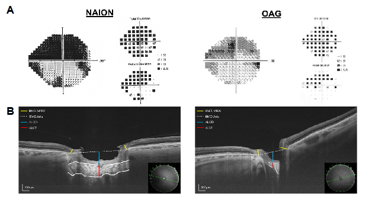

# Classifying Retinal Scans with Random Forest Algorithm

# Abstract

## Optical Coherence Tomography Metrics Accurately Classify Non-arteritic Anterior Ischemic Optic Neuropathy, Open-Angle Glaucoma, and Healthy Eyes

### Purpose:  
To compare optic nerve head and circumpapillary disc measurements between non-arteritic ischemic optic neuropathy (NAION), open-angle glaucoma (OAG), and healthy control eyes using swept-source optical coherence tomography (ss-OCT), and to find the combination of these metrics that can most accurately discriminate between the three groups.    

### Methods:
This cross-sectional study included 30 NAION eyes and 30 OAG eyes matched for age, 24-2 mean deviation, and location of visual loss, as well as 30 age-matched healthy controls. ss-OCT wide-field and radial scans were obtained for all eyes and used to measure circumpapillary retinal nerve fiber layer (cpRNFL) thickness, Bruch's membrane opening minimum rim width (BMO-MRW), central lamina cribrosa thickness (cLCT), and anterior lamina cribrosa depth (ALCD). These metrics were compared between groups, and used to train Random Forest (RF) models. Classification accuracies of the various RF models were computed to determine the most effective discriminators between the groups.   

### Results: 
NAION and OAG eyes had significantly thinner cpRNFL in all quadrants when compared to healthy eyes (all P < 0.001), but global and inferior cpRNFL were thicker in NAION eyes than in OAG eyes (both P < 0.01). OAG eyes had significantly thinner BMO-MRW, thinner cLCT, and greater ALCD than NAION and healthy eyes (all P < 0.001). A RF model using cpRNFL thickness in the 4 quadrants and cLCT yielded the highest classification accuracy, 92.14 ± 0.36%.

### Conclusions:
OCT metrics accurately discriminated between our three groups. Considering cLCT in addition to cpRNFL can improve the detection of glaucoma and help to rule out non-glaucomatous optic neuropathies such as NAION. Automated classification algorithms may play a useful role in clinical screening. 

# Manuscript

## Introduction:

Non-arteritic anterior ischemic optic neuropathy (NAION) is an acute optic neuropathy associated with hypoperfusion of the anterior optic nerve and characterized by sudden onset of visual loss, optic disc edema that subsides within weeks to months, and optic disc pallor.1 Unlike NAION, glaucoma is a progressive optic neuropathy that is often characterized by thinning of the neuroretinal rim and "cupping" of the optic disc, described by Burgoyne2 as the excavation of the anterior optic nerve head (ONH). The most common subset of glaucoma,  open-angle glaucoma (OAG), is distinguished by an open iridocorneal angle, involves no age-specific or intraocular pressure (IOP) criteria, and includes patients with forms of secondary glaucoma, such as those caused by pseudoexfoliation and pigment-dispersion syndrome.3 

Tomography and polarimetry have been used to show that both NAION and OAG cause damage to retinal ganglion cells and their axons, but only OAG exhibits neuroretinal rim thinning and optic disc excavation.4,5 While the swelling and pallor of the optic disc and an absence of cupping in NAION may distinguish it from OAG, both conditions have overlapping features and may cause similar retinal nerve fiber layer (RNFL) and visual field (VF) defects. Furthermore, because there remains no single test or measure that can detect glaucoma with certainty, comparing it to other forms of optic neuropathy such as NAION may help to improve diagnostic approaches and to better understand the distinct pathophysiologies of the two diseases.

Unique structural changes in the lamina cribrosa (LC) region of the ONH have been shown to occur in glaucoma, and researchers have used both optical coherence tomography (OCT) and engineering models to argue that deformation of the LC (thinning, bowing, posterior displacement, or otherwise) is a primary component of glaucomatous damage, likely due to mechanical IOP-associated stress.2,6-11 Still, while many researchers have used the anterior border of the LC to quantify its posterior displacement in glaucomatous eyes,6,12 few studies have attempted to employ metrics that involve the region's posterior border, such as LC thickness. Fard et al. were among the first to do so, using enhanced-depth imaging (EDI-OCT) to show that the LC is significantly thinner in glaucomatous eyes than in NAION or healthy eyes.10 To our knowledge, however, no study has yet compared the diagnostic abilities of LC metrics and traditional OCT metrics in distinguishing between NAION, OAG, and healthy eyes––learning more about these metrics and their effectiveness can potentially help to diagnose OAG with greater accuracy and to better distinguish it from non-glaucomatous optic neuropathies such as NAION.  

While research has shown that lamina cribrosa and neuroretinal rim morphology differ between OAG and NAION eyes, we sought to quantify the extent to which these metrics could be applied for differential diagnoses in a clinical context. We compared NAION, OAG, and healthy eyes (for whom a reference standard was pre-established) using swept-source OCT (ss-OCT) to assess which ONH and circumpapillary OCT metrics can best distinguish between the three groups. In recent years, researchers in ophthalmology have used machine learning to create diagnostic models that can accurately detect glaucoma,13,17 but such methods have neither involved LC metrics nor been used to distinguish between two optic neuropathies. To answer our research question, we adopted a similar approach and used our data to construct supervised learning models using the Random Forest classifier18 and evaluated the accuracies of these automated classification models in diagnosing patients using only OCT metrics. 

  
## Methods 

### Subjects

This study was approved by the Columbia University and New York Eye and Ear Infirmary of Mount Sinai Institutional Review Boards. Written informed consent was obtained from all eligible patients, and the study followed the tenets of the Declaration of Helsinki and the Health Insurance Portability and Accountability Act. 

This cross-sectional study enrolled 30 eyes from 24 NAION patients, 30 eyes from 30 OAG patients, and 30 eyes from 30 healthy controls. All participants received ss-OCT examination (Topcon DRI OCT-1 Atlantis and DRI-OCT Triton; Topcon Inc., Tokyo, Japan) at the Columbia University Visual Science Lab after clinical examinations and referral by their respective medical specialists. NAION and OAG patients also received 24-2 visual field testing (SITA-Standard, Humphrey Field Analyzer; Carl Zeiss Meditec Inc., Dublin, CA). 

NAION patients were diagnosed by a neuro-ophthalmologist (JD) at the Harkness Eye Institute of Columbia University based on complete clinical information, medical history, and fundus examination. Inclusion criteria for NAION eyes were (1) painless and sudden onset of visual loss (of altitudinal, arcuate, or cecocentral pattern); (2) swollen optic disc at the time of visual loss, followed by visual field stabilization and reduction in swelling within approximately 3 months; (3) retinal nerve fiber layer defect; and (4) optic disc pallor. Eyes with evidence of giant cell arteritis or other neurologic or ophthalmic disease were excluded from this study.

OAG patients were diagnosed by a glaucoma specialist (RR) at the New York Eye and Ear Infirmary and retrospectively enrolled in this study. OAG eyes were matched to NAION eyes on the basis of age, 24-2 VF mean deviation (MD), and pattern and location of visual loss (Figure 1A). Inclusion criteria for OAG eyes were (1) glaucomatous damage indicated by visible RNFL defect and thinning or notching of the neuroretinal rim; (2) an abnormal 24-2 VF corresponding to RNFL defects; and (3) an open iridocorneal angle. An abnormal 24-2 VF was defined by a glaucoma hemifield test outside normal limits and 4 or more abnormal pattern deviation points with P-value < 5% (Note: visual fields of 6 OAG eyes, each with MD < 22.00 dB, did not include pattern deviation plots due to severely depressed fields. Nonetheless, these eyes were included in the study if both MD and PSD were abnormal with P-value < 5%). 

**Figure 1**

_A: example of an NAION eye (left) and OAG eye (right) matched for age, 24-2 mean deviation, and pattern and location of visual loss. B: radial B-scans with schematic representations of optic nerve head measurements._

### Measurements 

While many in vivo studies on the lamina cribrosa have been performed using EDI-OCT, we used ss-OCT because it has been shown to be superior to EDI-OCT in imaging posterior segments of the optic nerve head,19 using a 1050 nm light source that allows for deeper penetration of light. For each eye in this study, DRI-OCT was used to obtain 12 radial scans (6 mm diameter, 1024 pixel resolution) centered on the optic disc and a single 12 x 9 mm wide-field scan (512 horizontal B-scan x 256 A-scan protocol). DRI-OCT segmentation algorithms measured circumpapillary retinal nerve fiber layer (cpRNFL) thickness from wide-field scans using a standard 3.4 mm diameter circle centered on the optic disc. 

OCT measurements of the ONH were made on radial scans using the DRI-OCT. Figure 1B presents an example of ss-OCT radial scans of a matched NAION eye (left) and OAG eye (right) with schematic representations of our three disc measures of interest. To quantify neuroretinal rim tissue thickness, we measured Bruch's membrane opening minimum rim width (BMO-MRW), defined as the minimum distance between the inner limiting membrane and the innermost termination of the Bruch's membrane,20 and measured BMO-MRW on all 12 radial scans of each eye. 

Posterior displacement and thinning of the lamina cribrosa due to mechanical stress have been implicated in the pathogenesis of glaucoma,6,10 and we therefore used two metrics to quantify the morphology of the lamina cribrosa: anterior lamina cribrosa depth (ALCD) as a measure for posterior displacement and central lamina cribrosa thickness (cLCT) as a measure for thinning. We defined ALCD as the distance from the level of the BMO to the anterior surface of the lamina cribrosa and cLCT as the distance between the anterior and posterior surfaces of the lamina cribrosa. Both measurements were made as close to the center of the disc as possible, defined by the horizontal midpoint between BMOs. For every eye, both ALCD and cLCT measures were taken on a single well-centered radial scan on which the lamina cribrosa could best be visualized. Because the measurement of the lamina cribrosa boundaries remains a challenge, ALCD and cLCT were measured by two masked observers (TN, KT).

### Statistical Methods 

To compare OCT metrics between groups, we performed analysis of variance (ANOVA) followed by pairwise comparisons adjusted for multiple comparisons using the Bonferroni method. A probability value of P < 0.05 was considered statistically significant. We used the Bland-Altman limits of agreement21 and the intraclass correlation coefficient to measure interobserver agreement and reproducibility for ALCD and cLCT. All statistical analyses were performed with R (Version 3.3.3, R Foundation for Statistical Computing, Vienna, Austria). 

### Random Forest Classifier

To assess and compare the diagnostic abilities of our various metrics, we used our dataset to train Random Forest (RF) models. RF is an ensemble learning method that creates a multitude of decision trees, each of which takes a random subset of the training data (this is known as bootstrap aggregation, or "bagging") and predicts a categorical outcome. The RF algorithm then uses the popular vote of the decision trees to predict classification/diagnosis.18 By adding a component of randomness, bootstrap aggregation is known to reduce overfitting to the training data, and therefore helps to build models that perform well when classifying new data. To estimate the classification accuracy of each model, we computed the out-of-bag (OOB) classification accuracy––an estimator for a RF model's ability to correctly classify unseen testing data. This accuracy represents how successfully a particular model can discriminate between healthy, NAION, and OAG eyes using OCT metrics. Because bootstrap aggregation involves randomly sampling the training data, OOB accuracy varies slightly for each iteration of the RF algorithm. To account for this variation, we ran each algorithm 100 times and determined the average OOB accuracy of the 100 trials. Moreover, we determined the relative importance of each individual variable by comparing mean decrease in accuracy, the detrimental effect on the model's accuracy if a particular variable is removed from the forest. 

## Results

Basic clinical characteristics of our subjects are presented in Table 1. There were no statistically significant differences in age, gender, 24-2 MD, or 24-2 pattern standard deviation (PSD) between our groups (note: healthy participants did not receive 24-2 visual field testing). 

**Table 1**

_* Result of ANOVA between groups. † T-test comparison of NAION and OAG means. ‡ Result of 2 test of independence. Data are mean ± standard deviation. Healthy controls did not receive 24-2 visual field tests._

Results for all the OCT metrics, including cpRNFL split by quadrant, are summarized in Table 2. Figure 2A compares the distribution of ALCD and cLCT between all three groups using box and jitter plots. The OAG group exhibited significantly thinner cLCT and greater ALCD than both the NAION and healthy groups. Figure 2B presents the Bland-Altman limits of agreement for cLCT and ALCD measurements of all eyes. According to the limits of agreement, the 95% confidence interval (CI) for interobserver differences in measuring cLCT and ALCD were ±44µm and ±32µm, respectively. There was also an intraclass correlation coefficient of 0.830 (95% CI = 0.753–0.885) and 0.992 (95% CI = 0.988–0.995) for cLCT and ALCD, respectively. 

**Table 2**

_Data are mean ± standard deviation. P, comparison of three groups using ANOVA; P1, comparison of Healthy vs NAION; P2, comparison of Healthy and OAG; P3, comparison of Healthy and NAION. P-values significant after Bonferroni correction for multiple comparisons (P<0.006) are in boldface._

**Figure 2**

_A: box and jitter plots comparing distributions of cLCT (left) and ALCD (right) between the three groups. B: Bland-Altman limits of agreement for cLCT (left) and ALCD (right) measurements._

Figure 3 presents MRW and cpRNFL of the groups by clock hour in NSTIN format. OAG eyes had thinner BMO-MRW at every clock hour than NAION and healthy eyes. Both NAION and OAG eyes had thinner global cpRNFL than healthy eyes, but NAION eyes had thicker global, inferonasal, and inferotemporal cpRNFL than OAG eyes.

**Figure 3**

_Comparisons of cpRNFL thickness and BMO-MRW between groups, presented in NSTIN format. Error bars are ± 2 standard errors._

Table 3 displays odds ratios for each metric, adjusted for age, derived from a multinomial logistic regression with the healthy group set as the reference. Individually, all 4 metrics were significant in distinguishing OAG eyes from healthy eyes, and global cpRNFL was significant in distinguishing NAION eyes from healthy eyes. Figure 4 presents relative variable importance by comparing mean decrease in OOB accuracy when each variable is removed from the four-variable RF model, suggesting that global cpRNFL and cLCT are very important, while global BMO-MRW and ALCD are less important, for classification.

**Table 3**

_ORNAION and OROAG are odds ratio results from a multinomial logistic regression for NAION and OAG classification, respectively, with healthy controls as the reference class. P values significant at the 5% level are in boldface. *All tests are adjusted for age._

**Figure 4**

_A comparison of the relative importance of each variable in a 4 variable Random Forest model._

Lastly, Table 4 lists OOB accuracies, specificities, and sensitivities for RF models with various combinations of the 4 metrics. Training the model with cpRNFL thickness in the 4 quadrants and cLCT yielded the highest average classification accuracy (92.14 ± 0.36%), very high specificity (96.67%), and high sensitivity for both NAION and OAG (93.33% and 86.67%, respectively); factoring in ALCD made no significant difference in model accuracy; factoring in BMO-MRW decreased model accuracy. Among the individual metrics, cLCT performed significantly better than global cpRNFL, global BMO-MRW, and ALCD. 

**Table 4**

_Out-of-bag prediction accuracy of Random Forest models, mean ± standard deviation. *All prediction models are adjusted for age._

## Discussion

In the present study, we compared cpRNFL thickness, BMO-MRW, cLCT, and ALCD between 30 NAION eyes, 30 OAG eyes, and 30 healthy eyes in an effort to better understand the differential effects of NAION and OAG in and around the optic disc. OAG eyes were matched to NAION eyes on the basis of 24-2 VF MD, age, and the location and pattern of visual loss. Age-matched healthy controls were also included. 

Unsurprisingly, the OAG and NAION groups exhibited significant cpRNFL thinning in all regions. Although the eyes in our study were matched on the basis of 24-2 MD, age, and pattern and location of visual loss, we found that the degree and location of RNFL loss was not the same between the two groups––global and inferior cpRNFL in OAG eyes were thinner than that of NAION eyes, while superior cpRNFL was similar between the two groups. Other cross-sectional studies have observed similar results, reporting greater thinning in the superior hemisphere than in the inferior hemisphere of NAION eyes4,22 and more extensive thinning of global RNFL in OAG eyes than in MD-matched NAION eyes.5 These differences in the global and local RNFL thicknesses of MD-matched NAION and OAG eyes suggest that OAG is more likely to cause diffuse RNFL thinning, while NAION more commonly causes localized or hemispheric RNFL defects.

In addition to differences in cpRNFL thickness between the groups, we also found that OAG eyes had significantly thinner lamina cribrosa tissue, greater lamina cribrosa depth, and thinner BMO-MRW when compared to both the NAION and healthy groups. Our findings are consistent with other comparisons of NAION and OAG eyes using OCT,4,10,12 suggesting that thinning of the neuroretinal rim and thinning and posterior displacement of the lamina cribrosa are characteristics of glaucomatous damage that are absent in non-glaucomatous optic neuropathy. These findings, along with the observation of thinner global cpRNFL in OAG eyes, suggest that OAG has a significantly greater structural impact on the tissues in and around the optic disc than NAION does. The differential structural effects of NAION and OAG are compatible with the underlying pathologies of the two conditions––while NAION is often characterized by a single ischemic event, it is reasonable for OAG to cause greater structural damage in the long-term due to the persistence of chronic mechanical stress on the retina and optic nerve head. 

Following the analysis of OCT metrics, we used the Random Forest classifier to discover the combination of metrics that can most accurately distinguish between the three groups. Amongst the four individual metrics, cLCT had the greatest success, performing better than global cpRNFL, global BMO-MRW, and ALCD; according to our analysis of variable importance, global cpRNFL and cLCT are crucial in achieving a high classification accuracy, while BMO-MRW and ALCD are relatively unimportant. We discovered that using only cpRNFL thickness (by quadrant) and cLCT, we were able to achieve excellent classification accuracy (92.14 ± 0.36%), high specificity (96.67%), and high sensitivity for both NAION and OAG (93.33% and 86.67%, respectively). Our results suggest that cLCT is a promising and effective diagnostic metric. While researchers and ophthalmologists have largely relied on cpRNFL thickness when diagnosing glaucoma, our findings argue that considering lamina cribrosa thickness in the process of diagnosis is beneficial not only for achieving greater accuracy in detecting glaucomatous damage, but also in ruling out non-glaucomatous damage. With future advancements in OCT and improved visualization of the posterior optic nerve, the lamina cribrosa region has the potential to become as widely considered as the RNFL in the discussion on glaucoma.

The results of this study have implications for the widespread implementation of OCT in clinical settings, and suggest that machine-learning classifiers such as Random Forest can use OCT metrics to assist medical specialists in the process of diagnosing optic neuropathies. Our classification model, in particular, was able to weigh multiple input variables to predict diagnoses with very high specificity and sensitivities. These findings suggest that rather than subjecting patients to a full clinical examination, visual field testing, and fundus examination, clinicians may eventually be able to use OCT scans and an automated classifier to effectively and efficiently screen large populations of individuals. Overall, this study provides strong evidence that OCT can play a pivotal role in the clinic. 

The results of this study, while promising, should be considered in the context of its limitations. While there was excellent interobserver agreement for our laminar metrics, the 95% confidence interval (CI) for interobserver differences in measuring cLCT and ALCD were ±44µm and ±32µm, respectively. As these limits of agreement suggest, the borders of the laminar region remain a challenge to measure, even with the use of ss-OCT. Nevertheless, our results suggest that the lamina cribrosa is worth studying for the sake of developing novel techniques for improved detection and diagnosis of glaucomatous damage, and future advancements in OCT will likely bring improved visualization of the deep optic nerve.

Although our model was very successful in three-way classification, our findings are not intended to suggest that such metric-based models can replace the role of a neuro-ophthalmologist or glaucoma specialist––we neither considered nor tested such a hypothesis. Rather, we argue that classification models similar to ours can potentially assist specialists in the process of diagnosis. 

In conclusion, we found that for the same extent of visual field loss, OAG eyes had thinner cLCT, thinner BMO-MRW, and greater ALCD than both NAION and healthy control eyes. While OAG and NAION eyes exhibited cpRNFL thinning, OAG eyes had greater global thinning than NAION eyes. These OCT metrics may provide insight into the distinct effects of NAION and OAG on tissue in and around the optic disc.  Moreover, a Random Forest model using only cpRNFL thickness and cLCT was able to discriminate between the three groups with very high sensitivity and specificity. Our results suggest that taking cLCT into consideration can improve the process of diagnosing glaucoma, and that automated classification models can accurately and efficiently use OCT metrics to screen for optic neuropathies in clinical environments.  

1.	Hayreh SS. Ischemic optic neuropathies - where are we now? Graefes Arch Clin Exp Ophthalmol. 2013;251(8):1873-1884.
2.	Burgoyne C. The morphological difference between glaucoma and other optic neuropathies. J Neuroophthalmol. 2015;35 Suppl 1:S8-S21.
3.	Kwon YH, Fingert JH, Kuehn MH, Alward WL. Primary open-angle glaucoma. N Engl J Med. 2009;360(11):1113-1124.
4.	Saito H, Tomidokoro A, Sugimoto E, et al. Optic disc topography and peripapillary retinal nerve fiber layer thickness in nonarteritic ischemic optic neuropathy and open-angle glaucoma. Ophthalmology. 2006;113(8):1340-1344.
5.	Danesh-Meyer HV, Boland MV, Savino PJ, et al. Optic disc morphology in open-angle glaucoma compared with anterior ischemic optic neuropathies. Invest Ophthalmol Vis Sci. 2010;51(4):2003-2010.
6.	Lee SH, Kim TW, Lee EJ, Girard MJ, Mari JM. Diagnostic Power of Lamina Cribrosa Depth and Curvature in Glaucoma. Invest Ophthalmol Vis Sci. 2017;58(2):755-762.
7.	Inoue R, Hangai M, Kotera Y, et al. Three-dimensional high-speed optical coherence tomography imaging of lamina cribrosa in glaucoma. Ophthalmology. 2009;116(2):214-222.
8.	Kiumehr S, Park SC, Syril D, et al. In vivo evaluation of focal lamina cribrosa defects in glaucoma. Arch Ophthalmol. 2012;130(5):552-559.
9.	Quigley HA, Hohman RM, Addicks EM, Massof RW, Green WR. Morphologic changes in the lamina cribrosa correlated with neural loss in open-angle glaucoma. Am J Ophthalmol. 1983;95(5):673-691.
10.	Fard MA, Afzali M, Abdi P, et al. Optic Nerve Head Morphology in Nonarteritic Anterior Ischemic Optic Neuropathy Compared to Open-Angle Glaucoma. Invest Ophthalmol Vis Sci. 2016;57(11):4632-4640.
11.	Bellezza AJ, Hart RT, Burgoyne CF. The optic nerve head as a biomechanical structure: initial finite element modeling. Invest Ophthalmol Vis Sci. 2000;41(10):2991-3000.
12.	Lee EJ, Choi YJ, Kim TW, Hwang JM. Comparison of the Deep Optic Nerve Head Structure between Normal-Tension Glaucoma and Nonarteritic Anterior Ischemic Optic Neuropathy. PLoS One. 2016;11(4):e0150242.
13.	Deo RC. Machine Learning in Medicine. Circulation. 2015;132(20):1920-1930.
14.	Gulshan V, Peng L, Coram M, et al. Development and Validation of a Deep Learning Algorithm for Detection of Diabetic Retinopathy in Retinal Fundus Photographs. JAMA. 2016;316(22):2402-2410.
15.	Tabassian M, Alessandrini M, Herbots L, et al. Machine learning of the spatio-temporal characteristics of echocardiographic deformation curves for infarct classification. Int J Cardiovasc Imaging. 2017;33(8):1159-1167.
16.	Muhammad H FT, De Cuir N, De Moraes CG, Blumberg DM, Liebmann JM, Ritch R, Hood DC. Hybrid Deep Learning on Single Wide-field Optical Coherence Tomography Scans Accurately Classifies Glaucoma Suspects. Journal of Glaucoma. 2017.
17.	Esteva A, Kuprel B, Novoa RA, et al. Dermatologist-level classification of skin cancer with deep neural networks. Nature. 2017;542(7639):115-118.
18.	Breiman L. Random Forests. Machine Learning. 2001;45(1):5-32.
19.	Park HY, Shin HY, Park CK. Imaging the posterior segment of the eye using swept-source optical coherence tomography in myopic glaucoma eyes: comparison with enhanced-depth imaging. Am J Ophthalmol. 2014;157(3):550-557.
20.	Chauhan BC, Burgoyne CF. From clinical examination of the optic disc to clinical assessment of the optic nerve head: a paradigm change. Am J Ophthalmol. 2013;156(2):218-227 e212.
21.	Bland JM, Altman DG. Statistical methods for assessing agreement between two methods of clinical measurement. Lancet. 1986;1(8476):307-310.
22.	Han S, Jung JJ, Kim US. Differences between Non-arteritic Anterior Ischemic Optic Neuropathy and Open Angle Glaucoma with Altitudinal Visual Field Defect. Korean J Ophthalmol. 2015;29(6):418-423.
